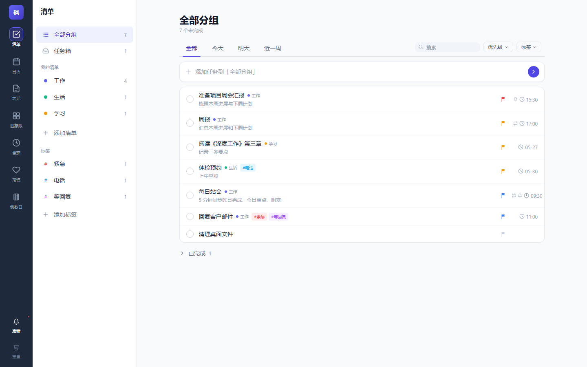

# 枫桦清单 (Maple Tasks)

> 一个**已冻结**的个人清单 + 笔记 Web App。  
> 公开演示：<https://espectre.github.io/spec_list/>



## 项目状态：FROZEN（2026-05-25）

为什么冻结：评估后认为投入 1.5-2 天接 Supabase 做跨端同步，性价比不如直接用 [滴答清单](https://www.dida365.com/) / [思源笔记](https://b3log.org/siyuan/) / [Notion](https://www.notion.so/) 这类成熟商业 App。本项目作为**完整可读的工程练习样本**保留，将来想加某个特定工作流再回来。

详见底部「为什么冻结」一节。

---

## 这是什么

参照 [闪点清单](https://www.shandian.li/) 电脑版做的纯前端 Web App，无需后端，纯 HTML + CSS + JavaScript，数据存浏览器 localStorage。

**已完成的功能**：

| 模块 | 功能 |
|---|---|
| **清单（任务）** | 多清单 + 标签 + 子任务 + 4 色优先级旗 + 截止时间 + **重复任务**（日/周/月/年）+ **浏览器通知提醒**（提前 5/10/30 分钟…）+ 4 种排序 + 标签筛选 + 4 段快速添加 chip + 全部/今天/明天/近一周 时间窗 |
| **日历** | 月视图 + 当日任务列表 + 4 色象限点 + 直接添加任务 |
| **笔记** | 笔记本（分组） + 置顶 + 全文搜索 + 自动保存 + 移动端 master-detail |
| **四象限** | 重要紧急矩阵 + 拖拽换格 |
| **专注 / 习惯 / 倒数日** | UI 占位，未实现真功能 |
| **基础设施** | Toast + 5 秒撤销删除、更新日志面板（带"看一眼"高亮跳转）、icon-nav 三栏布局、移动端响应式 |

不可解决的天花板（已评估）：
- 浏览器关闭后无法推送通知（要 Service Worker push 或原生 App）
- 单设备 localStorage，无跨端同步（要后端 + 账号）
- iPhone Safari 加主屏后体验有 Apple 政策限制

---

## 怎么跑

### 方式 A：直接打开 Pages
浏览器访问 <https://espectre.github.io/spec_list/>，地址栏右侧点"安装"可装成 PWA-like 独立窗口（虽然没正式做 manifest，Chrome/Edge 仍提供有限的安装功能）。

### 方式 B：本地起一个静态服务器

需要 PowerShell（Windows 内置）：

```powershell
powershell -ExecutionPolicy Bypass -File server.ps1 -Port 8765
```

然后访问 <http://localhost:8765>。`server.ps1` 是用 `System.Net.HttpListener` 写的最小静态服务器，无需 Node/Python/任何依赖。

### 方式 C：用 Claude Code 的 Launch 预览

`.claude/launch.json` 已配，直接在 Claude Code 里点启动 `shandian` 即可。

---

## 数据 & 存储

所有数据放浏览器 `localStorage`，key = `shandian.v1`，单一 JSON 对象：

```js
{
  tasks: Task[],
  notes: Note[],
  lists: List[],          // 任务清单
  tags:  Tag[],           // 跨任务标签
  notebooks: Notebook[],  // 笔记本
  meta: { version, seededAt }
}
```

### 数据模型

```ts
type Task = {
  id: string;
  title: string;
  detail: string;
  listId: string | null;          // null = 任务箱（收件箱）
  tagIds: string[];
  dueAt: ISOString | null;
  importance: 0 | 1;              // 配合 urgency 推导 4 色旗子
  urgency: 0 | 1;
  subtasks: SubTask[];
  repeat: null | { rule: 'daily' | 'weekly' | 'monthly' | 'yearly' };
  reminder: null | { offsetMinutes: number };
  reminderFiredAt: ISOString | null;
  completed: boolean;
  completedAt: ISOString | null;
  lastCompletedAt: ISOString | null;  // 重复任务上次推进时刻
  createdAt: ISOString;
  updatedAt: ISOString;
};

type SubTask  = { id, title, completed, createdAt };
type List     = { id, name, color, order, createdAt };
type Tag      = { id, name, color, createdAt };
type Notebook = { id, name, color, order, createdAt };
type Note     = { id, title, content, notebookId, pinned, createdAt, updatedAt };
```

### Schema 演化策略

`js/store.js` 的 `load()` 每次启动都做 **backfill**——发现旧数据缺新字段时自动补默认值。所有 8 轮迭代里没有破坏过任何已有数据。如果将来加字段，遵循同样模式即可。

### 备份

目前没有内建导出功能（当时被推到下一轮，结果项目冻结了）。**手动备份**：

```js
// 浏览器 DevTools Console 里运行：
copy(localStorage.getItem('shandian.v1'));
// 已复制到剪贴板，粘到任意文本文件即可

// 恢复：
localStorage.setItem('shandian.v1', '<粘进来>');
location.reload();
```

---

## 架构

### 文件布局

```
shandian/
├── index.html                  应用外壳：icon-nav + group-nav + main 三栏
├── styles.css                  Tailwind 之外的少量自定义样式（toast、勾选框、高亮脉冲）
├── server.ps1                  本地静态服务器（PowerShell + HttpListener）
├── .claude/launch.json         Claude Code 启动配置
└── js/
    ├── utils.js                日期格式化、uid、debounce、escape
    ├── store.js                数据层：所有 CRUD + localStorage + 订阅
    ├── icons.js                内联 SVG 图标（lucide 风格）
    ├── reminder.js             定时扫描 + Notification API
    ├── changelog.js            更新日志数据 + "看一眼"跳转
    ├── app.js                  路由 + 顶层导航渲染 + Toast / Modal 全局工具
    └── views/
        ├── schedule.js         清单（任务）视图
        ├── calendar.js         日历视图
        ├── notes.js            笔记视图
        ├── detail.js           任务详情面板（右侧滑出）
        ├── matrix.js           四象限视图
        ├── focus.js            番茄占位
        ├── habits.js           习惯占位
        └── countdown.js        倒数日占位
```

### 关键模式

- **无构建**：所有 JS 用 `<script src>` 顺序加载到全局 `App` 命名空间。Tailwind 走 JIT CDN（浏览器里编译）。
- **状态**：`App.store` 单例，订阅式（`store.subscribe(cb)`）。视图自己决定何时重渲染。
- **路由**：纯 hash 路由。`#/schedule/list/<id>`、`#/schedule/tag/<id>`、`#/notes/notebook/<id>` 等子路由由各视图自己解析。
- **视图生命周期**：每个 view 暴露 `mount(root, header)` 返回 cleanup 函数。`app.js` 在路由变化时 cleanup + remount。
- **撤销**：删除返回 snapshot；Toast 上"撤销"按钮调对应 `restore*` 把数据塞回去。
- **更新日志**：`App.CHANGELOG` 数组，按时间倒序。新发布前最前面加一条。条目里的 `highlights` 包含一组"看一眼"按钮，自动跳路由 + 在目标元素加 1.4s 紫色脉冲。

### 路由表

| Hash | 视图 |
|---|---|
| `#/schedule` | 清单（"全部分组"） |
| `#/schedule/inbox` | 任务箱 |
| `#/schedule/list/<id>` | 指定清单 |
| `#/schedule/tag/<id>` | 指定标签筛选 |
| `#/calendar` | 日历 |
| `#/notes` | 全部笔记 |
| `#/notes/pinned` | 置顶笔记 |
| `#/notes/uncat` | 未分类笔记 |
| `#/notes/notebook/<id>` | 指定笔记本 |
| `#/matrix` | 四象限 |
| `#/focus` | 番茄（占位） |
| `#/habits` | 习惯（占位） |
| `#/countdown` | 倒数日（占位） |

---

## 开发历史 & PR 列表

| PR | 标题 | 内容简述 |
|---|---|---|
| #1 | 重命名应用为「枫桦清单」 | 改名 |
| #2 | 重构布局参考闪点清单电脑版 | 三栏 icon-nav + group-nav + main |
| #3 | 任务详情面板（含子任务） | 右侧滑出面板替代弹窗 |
| #4 | 标签系统 + 更新日志机制 | 跨任务标签 + 铃铛红点更新提示 |
| #5 | 重复任务 | 日/周/月/年循环 + 完成时推进 |
| #6 | 排序 / 标签筛选 / 快速添加内联 chip | 顶部工具栏 + 输入文字后冒 4 个 chip |
| #7 | 任务提醒（浏览器通知） | Notification API + 引导开启 |
| #8 | 笔记本（笔记分组） | 笔记从扁平升级到分组 |

---

## 已知 / 待做

### 永远做不了的（Web 平台天花板）
- iPhone Safari 后台 push（Apple 不让 Web 拿）
- 桌面挂件 / 锁屏挂件（需要原生 App）
- Tailwind 生产编译（现在跑 CDN JIT，控制台有 warning，无功能影响）

### 没做但容易补（每项半天到一天）
- **数据导出 / 导入 JSON**（最该补的，保命用）
- **真番茄钟**（25:00 真能跑 + 选任务 + 记录专注时长）
- **真习惯打卡**（CRUD + streak + 热力图）
- **真倒数日**（CRUD + 按倒计时排序）
- **笔记 Markdown 渲染**（预览开关）
- **任务/笔记共享标签系统**（数据层已通用）
- **全局搜索**（Cmd/Ctrl + K）
- **暗黑模式**
- **键盘快捷键**（`/` 搜索、`N` 新建、`1-4` 切视图）
- **日历周/日视图 + 时间块**
- **拖拽改期**（日历或任务行）
- **回收站**（30 天软删除）
- **PWA manifest + Service Worker**（装机像 App）

### 需要重投入的（不在 Web 栈或要服务端）
- **跨端同步**：要 Supabase / Firebase / 自建后端 + 邮箱登录 + sync 层。评估 1.5-2 天
- **协作 / 分享清单**：同上
- **真后台通知**：Service Worker push，要 Push 服务（OneSignal / 自建 VAPID）
- **微信收藏转任务**：要微信开放平台
- **自然语言输入**："明天下午 3 点开会" → 解析时间。用 chrono-node 或自写
- **原生 iOS App**：Capacitor 包装 + Apple 开发者账号 $99/年 + 应用商店审核

---

## 为什么冻结

短答：评估后认为继续投入跨端同步等关键功能的成本，**不如直接用成熟商业 App**。

### 决策过程
1. 用了几天后，作者反馈："感觉用这个不如直接用闪点清单"
2. 真实痛点重新梳理：**闪点的笔记功能要付费**，其余功能闪点已经够用
3. 评估"自己做 + Supabase 同步" 需要 1.5-2 天且后续无人维护
4. 评估直接用商业替代：
   - **滴答清单（TickTick）**：免费版含笔记，最像闪点，国内速度好 → 推荐
   - **Notion**：免费，跨端同步，但学习曲线陡
   - **思源笔记**：开源，本地优先，同步要付费
5. 结论：暂停。商业 App 解决主要问题，本项目作为"完整工程样本"保留

### 什么情况下会回来
- 想做某个非常特定的、商业 App 不会做的工作流（比如自动把日历会议转任务 + 笔记）
- 商业 App 涨价/跑路/变质，需要备用方案
- 纯粹想加某个具体小功能玩玩

代码是你的，数据可手动从 localStorage 导出，没人绑架你。

---

## 致谢 & 设计参考

- UI / IA 参考 [闪点清单](https://www.shandian.li/) 电脑版
- 色调 / 图标风格借鉴 [lucide](https://lucide.dev/)
- CSS 用 [Tailwind CSS](https://tailwindcss.com/)（CDN JIT）
- 中文字体堆栈：PingFang SC / 苹方 / 思源黑体

主色保留紫 `#6366f1`，不抄闪点的墨绿，避免视觉混淆。
